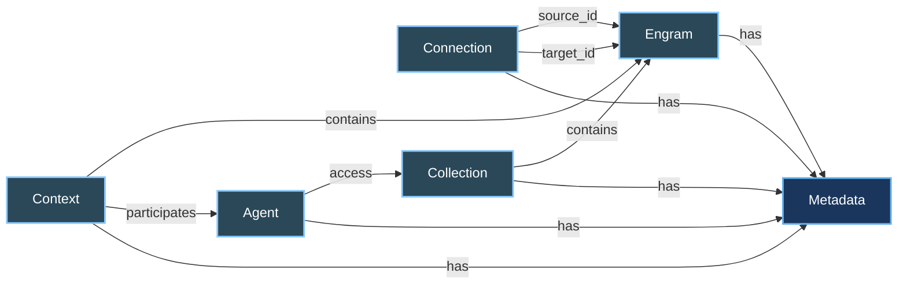
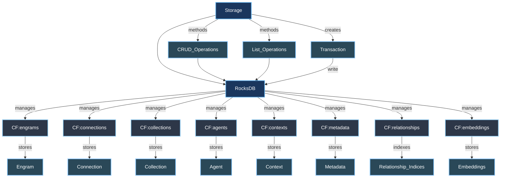
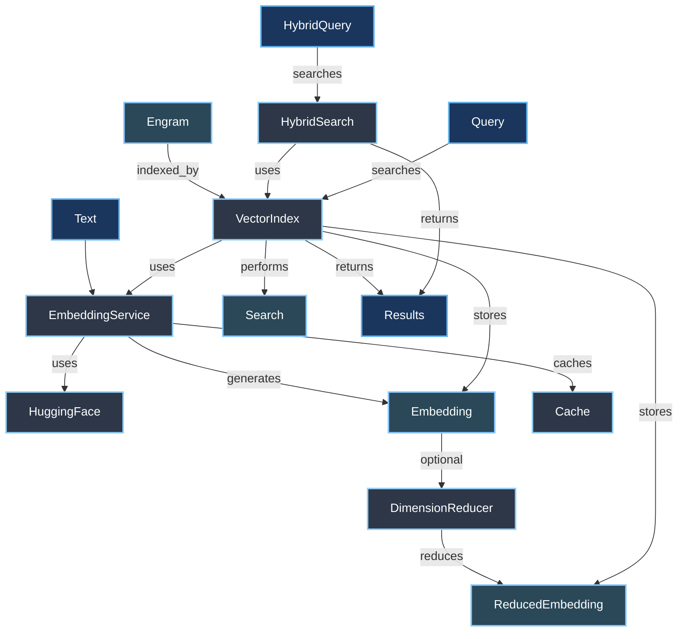

Okay, let's generate some Mermaid diagrams to illustrate various aspects of the `engram-lite` codebase based on the provided source code structure and content.

We'll cover:

1.  **Overall Architecture:** High-level components and their interactions.
2.  **Core Data Model:** Relationships between the main schema entities.
3.  **Persistence Layer:** How data is stored using RocksDB and Column Families.
4.  **Indexing & Querying:** The different in-memory indexes and how queries/traversals work.
5.  **Embedding & Vector Search:** How text is converted to vectors and used for similarity search.
6.  **Application Interfaces:** How the various binaries (`engramlt`, `engram_server`) provide different ways to interact with the core library.

---

## 1. Overall Architecture

This diagram shows the main logical layers and components of the `engram-lite` system and how different interfaces interact with the core.

```mermaid
graph TD
    subgraph "Application_Interfaces"
        A[engramlt_CLI] --> B{Command_Dispatcher}
        B --> C[Interactive_CLI]
        B --> D[Terminal_UI]
        B --> E[Web_Server]
        B --> F[Demo_Data_Population]
        B --> G[Docs_Server]
        B --> H[gRPC_Server]
        I[Python_Bindings] --> J[lib/python_Module]
    end

    subgraph "Core_Library"
        subgraph "Data_Management"
            K[Schema]
            L[Storage]
            M[Memory_Graph]
        end

        subgraph "Indexing_Querying"
            N[Search_Indexes]
            O[Query_Engine]
            P[Traversal_Engine]
            Q[Query_Service]
            R[Hybrid_Search_Engine]
        end

        subgraph "Embedding_Vector_Search"
            S[Embedding_Service]
            T[Dimension_Reduction]
            U[Vector_Index]
            V[HNSW_Index]
        end

        W[Export_Import]
        X[Error_Handling]
        Y[Utilities]
        Z[Benchmarking]
    end

    C --> Q
    D --> Q & M
    E --> L & M & N & S & U
    H --> L & N & S & U
    J --> L & S & U
    F --> L
    W --> L
    X --> Core_Library
    Y --> Core_Library

    classDef default fill:#2a4858,stroke:#89c8ff,stroke-width:2px,color:#fff
    classDef group fill:#1a365d,stroke:#63b3ed,stroke-width:3px,color:#fff
    classDef component fill:#2d3748,stroke:#90cdf4,stroke-width:2px,color:#fff

    class Application_Interfaces,Core_Library,Data_Management,Indexing_Querying,Embedding_Vector_Search group
    class A,B,C,D,E,F,G,H,I,J,K,L,M,N,O,P,Q,R,S,T,U,V,W,X,Y,Z component
```

**Explanation:**

*   The diagram groups components into "Application Interfaces" and "Core Library".
*   `engramlt` acts as a command dispatcher, launching different modes (CLI, TUI, Web, Demo, Docs). `engram_server` provides the gRPC interface directly.
*   The Core Library is structured around Data Management (Schema, Storage, Memory Graph), Indexing & Querying, and Embedding & Vector Search.
*   Dependencies and interactions are shown with arrows. E.g., Storage interacts with the Schema definition, the Query Engine uses both Storage and Indexes.

---

## 2. Core Data Model

This diagram focuses on the entities defined in `schema.rs` and their relationships.

**Explanation:**

*   The diagram shows the five primary entities: Engram, Connection, Collection, Agent, and Context.
*   Arrows represent the explicit relationships defined between these entities (e.g., a `Connection` links two `Engram`s).
*   `Metadata` is shown as a common attribute associated with all entities.

---

## 3. Persistence Layer (Storage)

This diagram details the `Storage` component's interaction with RocksDB and its use of Column Families.

**Explanation:**

*   `Storage` is the main struct that wraps the `RocksDB` instance (`DB`).
*   RocksDB uses different `Column Families` (`CFs`) to partition data by type.
*   `Storage` provides standard CRUD and listing methods, interacting with the appropriate CFs.
*   It also supports `Transaction`s, which use a `WriteBatch` for atomic operations.
*   Specific CFs are used to store the main entity data, metadata, relationship indices, and embeddings.

---

## 4. Indexing and Querying Logic

This diagram details the in-memory indexes and how the `QueryEngine`, `TraversalEngine`, and `QueryService` use them along with storage.

```mermaid
graph LR
    subgraph Indexes
        A[TextIndex]
        B[MetadataIndex]
        C[RelationshipIndex]
        D[SourceIndex]
        E[ConfidenceIndex]
    end

    F[Storage]
    G[QueryEngine]
    H[TraversalEngine]
    I[QueryService]

    SearchIndex -->|contains| A & B & C & D & E

    G -->|uses| F
    G -->|uses| SearchIndex
    H -->|uses| F
    H -->|uses| SearchIndex

    I -->|wraps| G
    I -->|wraps| H

    Query[Query] -->|executes| G
    Traversal[Traversal] -->|executes| H
    G -->|produces| Result[Result]
    H -->|produces| Result
    I -->|provides| Query
    I -->|provides| Traversal

    classDef index fill:#000,stroke:#333
    class A,B,C,D,E,SearchIndex index
    class Engine fill:#bbf,stroke:#333
    class G,H,I Engine
```

**Explanation:**

*   `SearchIndex` aggregates multiple specialized in-memory indexes: `TextIndex`, `MetadataIndex`, `RelationshipIndex`, `Source Index`, and `Confidence Index`.
*   `QueryEngine` is responsible for executing `EngramQuery` and `RelationshipQuery` by utilizing both the `Storage` (to fetch full entities) and the `SearchIndex` (to find relevant IDs).
*   `TraversalEngine` handles graph traversal operations, also using `Storage` and `SearchIndex`.
*   `QueryService` provides a simplified, higher-level interface by wrapping the `QueryEngine` and `TraversalEngine`.

---

## 5. Embedding and Vector Search

This diagram focuses on how text is converted to vector embeddings, optionally reduced in dimensionality, and used for similarity search.

**Explanation:**

*   `Text` is input to the `EmbeddingService`.
*   `EmbeddingService` generates `Embedding` vectors, potentially calling an external API like HuggingFace and using an internal `Embedding Cache`.
*   Optionally, a `DimensionReducer` can reduce the `Embedding` dimensionality, resulting in a `ReducedEmbedding`.
*   The `VectorIndex` (specifically using an `HNSW Index` internally) stores these embeddings (original or reduced).
*   When an `Engram` is added to the system, its content can be embedded and added to the `VectorIndex`.
*   The `VectorIndex` performs `Search` based on `Query` inputs.
*   The `HybridSearch` combines vector search results from `VectorIndex` with results from keyword/metadata searches (not explicitly shown here, but implied from diagram 4).

---

## 6. Application Interfaces

This diagram shows how the main entry point `engramlt` and the separate `engram_server` binary provide different ways to interact with the core library functions.

```mermaid
graph TD
    subgraph External
        User -->|uses| CLI[CommandLine]
        System -->|uses| GRPC[gRPC]
    end

    subgraph Binaries
        Engramlt
        EngramServer
        TUI[TUI_Binary]
        Web[Web_Binary]
        CLIBin[CLI_Binary]
        Demo[Demo_Binary]
        MCP[MCP_Binary]
    end

    subgraph CoreLib
        Core[Core_Logic]
    end

    CLI -->|args| Engramlt

    Engramlt -->|cli| CLIBin
    Engramlt -->|tui| TUI
    Engramlt -->|web| Web
    Engramlt -->|demo| Demo
    Engramlt -->|docs| Docs[DocsServer]

    CLIBin --> Core
    TUI --> Core
    Web --> Core
    Demo --> Core
    MCP --> Core

    GRPC --> EngramServer
    EngramServer --> Core

    classDef binary fill:#2a4858,stroke:#89c8ff,stroke-dasharray:5 5
    class Engramlt,EngramServer,TUI,Web,CLIBin,Demo,MCP binary
```

**Explanation:**

*   `engramlt` is the primary user-facing binary for CLI, TUI, Web UI, and Demo operations. It parses command-line arguments and delegates to the appropriate internal module or helper binary.
*   `engram_server` is a separate binary dedicated to running the gRPC service, intended for programmatic access by external systems.
*   Each interface binary (`CLIBin`, `TUI`, `Web`, `EngramServer`, `Demo`, `MCP`) interacts with the `Core Logic` provided by the `lib.rs` module.
*   The diagram shows `engramlt` launching other binaries or modules for specific commands, while `engram_server` runs standalone and is accessed via gRPC.
*   `MCP` is shown as a placeholder for a potentially separate protocol server.

---

These diagrams provide a visual overview of the structure and relationships within the `engram-lite` codebase, covering the requested aspects like architecture, core components, and interaction flows.