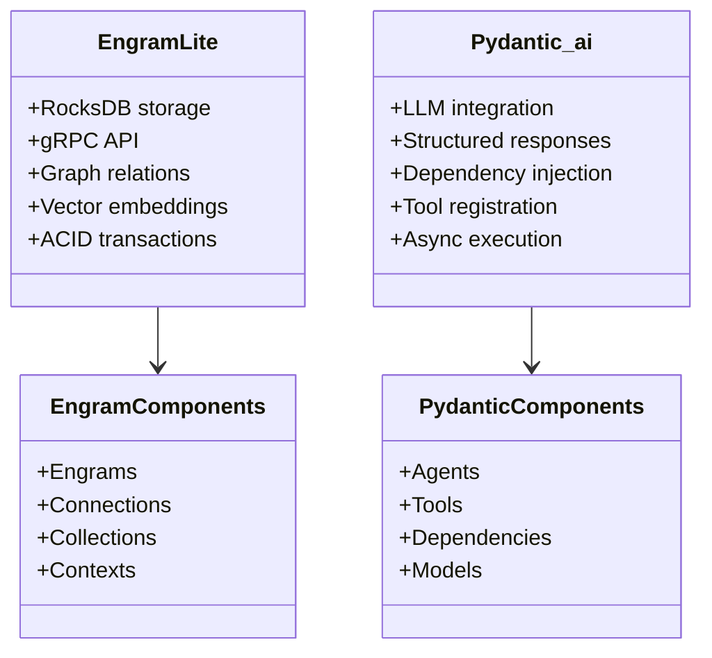
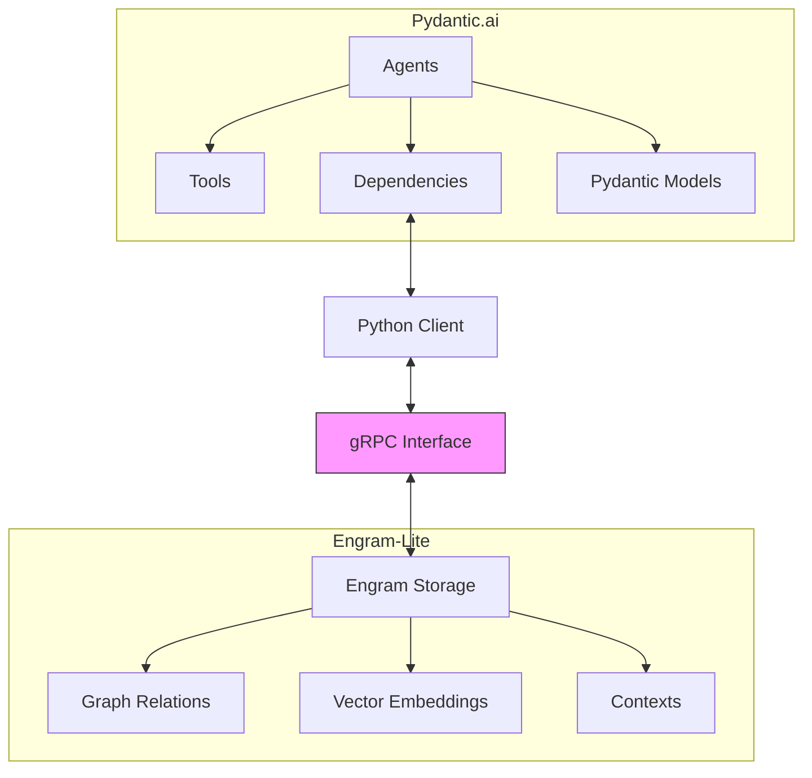
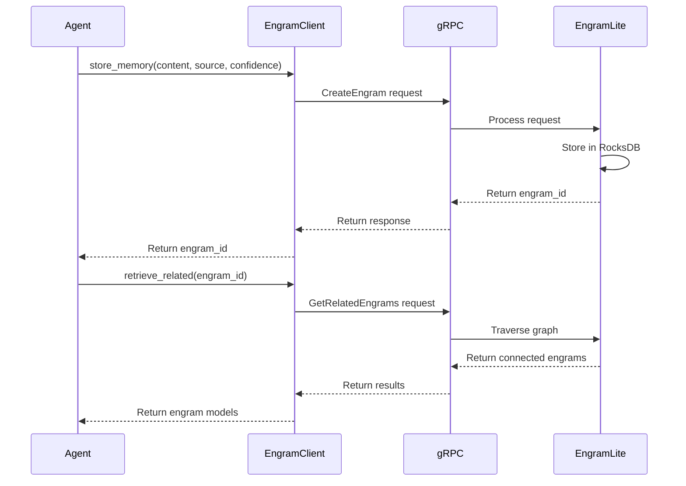
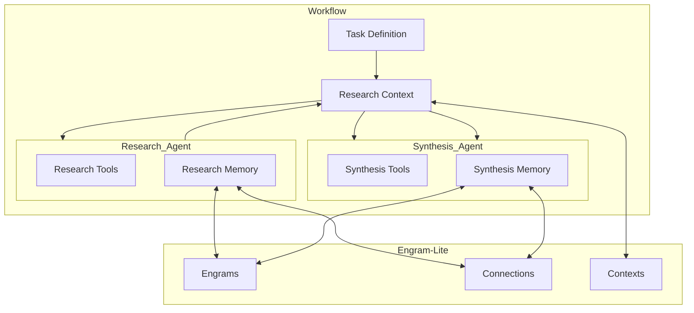
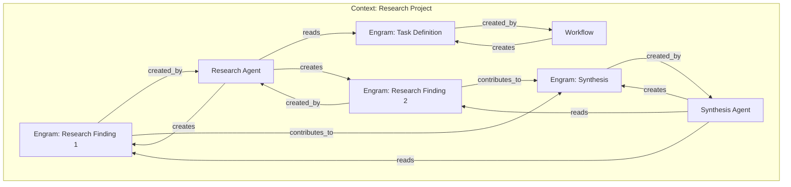
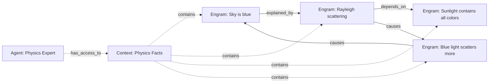
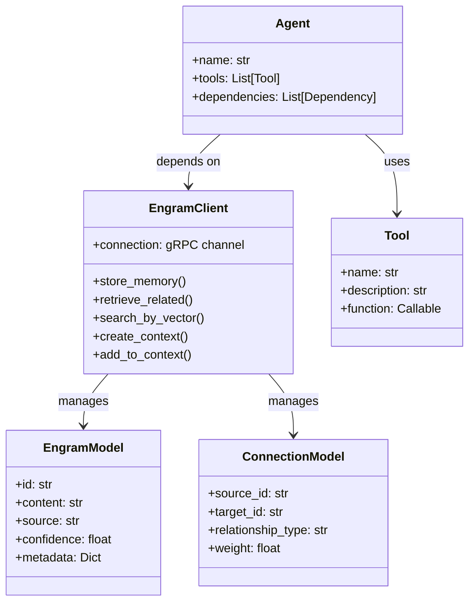
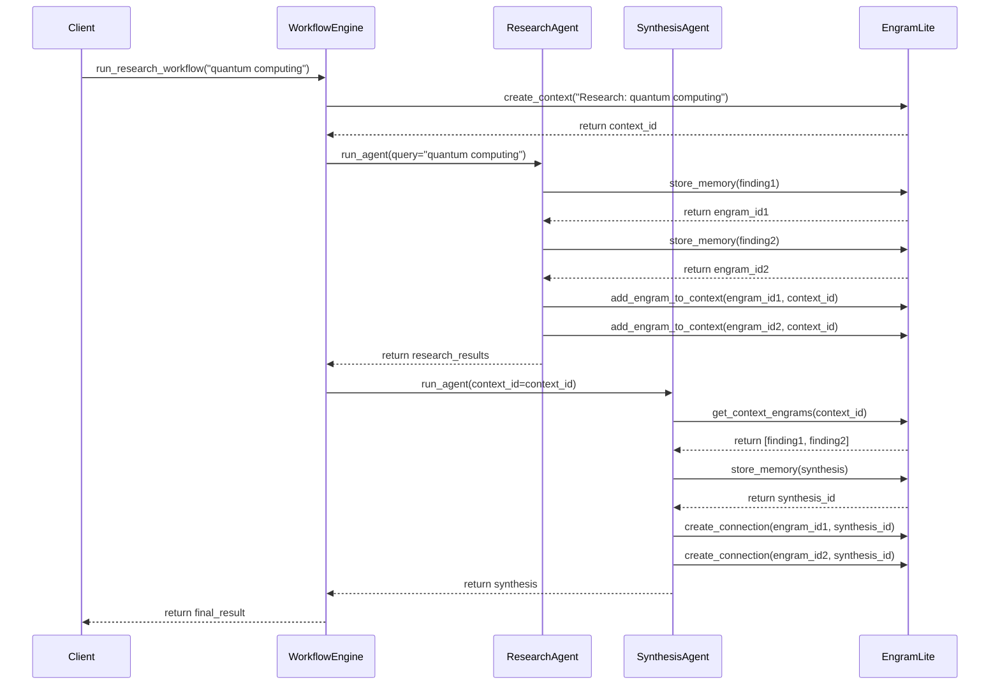

# Mermaid Diagrams for Engram-Lite & Pydantic.ai Integration

## 1. Component Overview

## 2. Integration Architecture

## 3. Memory Layer Integration

## 4. Multi-Agent Workflow Architecture

## 5. Agent Runtime Using Contexts

## 6. Engram Knowledge Graph Structure

## 7. Integration Implementation Components

## 8. Multi-Agent Workflow Process

