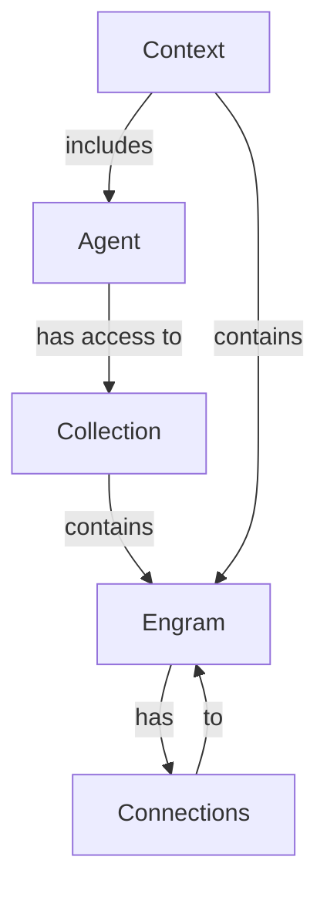

# Data Model

EngramAI Lite is built around a cognitive data model that mimics how humans organize knowledge. This document explains the core data types and their relationships.

## Core Types

### Engram

An Engram is the atomic unit of knowledge in the system. It represents a single piece of information or memory.

#### Fields:

- **id** (`String`): Unique identifier for the engram (UUID)
- **content** (`String`): The actual knowledge/information content
- **timestamp** (`DateTime<Utc>`): When this engram was created
- **source** (`String`): Where this knowledge came from
- **confidence** (`f64`): Certainty score between 0.0 and 1.0
- **metadata** (`HashMap<String, Value>`): Additional custom metadata

#### Rust Implementation:

```rust
pub struct Engram {
    pub id: EngramId,
    pub content: String,
    pub timestamp: DateTime<Utc>,
    pub source: String,
    pub confidence: f64,
    pub metadata: Metadata,
}
```

### Connection

A Connection represents a typed, weighted relationship between two engrams.

#### Fields:

- **id** (`String`): Unique identifier for the connection (UUID)
- **source_id** (`String`): ID of the source engram
- **target_id** (`String`): ID of the target engram
- **relationship_type** (`String`): Type of relationship (e.g., "causes", "supports", "contradicts")
- **weight** (`f64`): Strength of the connection between 0.0 and 1.0
- **metadata** (`HashMap<String, Value>`): Additional custom metadata

#### Rust Implementation:

```rust
pub struct Connection {
    pub id: ConnectionId,
    pub source_id: EngramId,
    pub target_id: EngramId,
    pub relationship_type: String,
    pub weight: f64,
    pub metadata: Metadata,
}
```

### Collection

A Collection is a named grouping of engrams for organization.

#### Fields:

- **id** (`String`): Unique identifier for the collection (UUID)
- **name** (`String`): Name of the collection
- **description** (`String`): Description of what this collection represents
- **engram_ids** (`HashSet<String>`): Set of engram IDs in this collection
- **metadata** (`HashMap<String, Value>`): Additional custom metadata

#### Rust Implementation:

```rust
pub struct Collection {
    pub id: CollectionId,
    pub name: String,
    pub description: String,
    pub engram_ids: HashSet<EngramId>,
    pub metadata: Metadata,
}
```

### Agent

An Agent represents an entity with access controls and capabilities within the system.

#### Fields:

- **id** (`String`): Unique identifier for the agent (UUID)
- **name** (`String`): Name of the agent
- **description** (`String`): Description of the agent's role/purpose
- **capabilities** (`HashSet<String>`): Set of capabilities this agent has
- **accessible_collections** (`HashSet<String>`): Collection IDs this agent can access
- **metadata** (`HashMap<String, Value>`): Additional custom metadata

#### Rust Implementation:

```rust
pub struct Agent {
    pub id: AgentId,
    pub name: String,
    pub description: String,
    pub capabilities: HashSet<String>,
    pub accessible_collections: HashSet<CollectionId>,
    pub metadata: Metadata,
}
```

### Context

A Context is a shareable environment with relevant engrams for agent collaboration.

#### Fields:

- **id** (`String`): Unique identifier for the context (UUID)
- **name** (`String`): Name of the context
- **description** (`String`): Description of what this context represents
- **engram_ids** (`HashSet<String>`): Set of engram IDs in this context
- **agent_ids** (`HashSet<String>`): Set of agent IDs with access to this context
- **metadata** (`HashMap<String, Value>`): Additional custom metadata

#### Rust Implementation:

```rust
pub struct Context {
    pub id: ContextId,
    pub name: String,
    pub description: String,
    pub engram_ids: HashSet<EngramId>,
    pub agent_ids: HashSet<AgentId>,
    pub metadata: Metadata,
}
```

## Relationships

The diagram below illustrates the relationships between the core data types:



### Key Relationships:

1. **Engram-to-Engram**: Engrams connect to other engrams through typed, weighted connections
2. **Collection-to-Engram**: Collections contain multiple engrams (one-to-many)
3. **Agent-to-Collection**: Agents have access to collections (many-to-many)
4. **Context-to-Engram**: Contexts contain engrams relevant to a collaboration scenario
5. **Context-to-Agent**: Contexts include agents that participate in the collaboration

## Metadata Flexibility

All core types support arbitrary metadata as key-value pairs. This provides flexibility to extend the data model without schema changes.

Common metadata fields include:

- **tags** (`Array<String>`): Labels for categorization
- **importance** (`Number`): A score indicating importance
- **last_accessed** (`DateTime`): When this item was last accessed
- **embedding** (`Array<Number>`): Vector embedding for AI search

Example usage:

```rust
let mut metadata = HashMap::new();
metadata.insert("tags".to_string(), json!(["geography", "europe", "capital"]));
metadata.insert("importance".to_string(), json!(0.8));
metadata.insert("embedding".to_string(), json!([0.1, 0.2, 0.3, 0.4]));

let engram = Engram::new(
    "The capital of France is Paris".to_string(),
    "geography".to_string(),
    0.95,
    Some(metadata),
);
```

## Type Aliases

For code clarity, EngramAI Lite uses type aliases for IDs:

```rust
pub type EngramId = String;
pub type ConnectionId = String;
pub type CollectionId = String;
pub type AgentId = String;
pub type ContextId = String;
pub type Metadata = HashMap<String, serde_json::Value>;
```